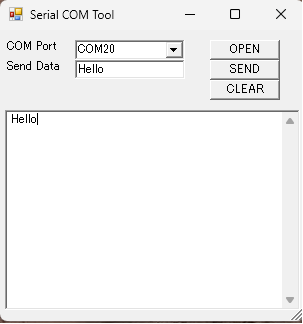

# PowerShell Serial COM Tool
  * This tool allows you to send and receive characters via a COM port using PowerShell.
  * No compilation or libraries are required.
  * It can be used just like Tera Term.  
  * It runs in the standard PowerShell environment on Windows 11.
  * To run it, please click the bat file.
  * If you wish to modify it, please edit the .ps1 file using a text editor.

# Example

